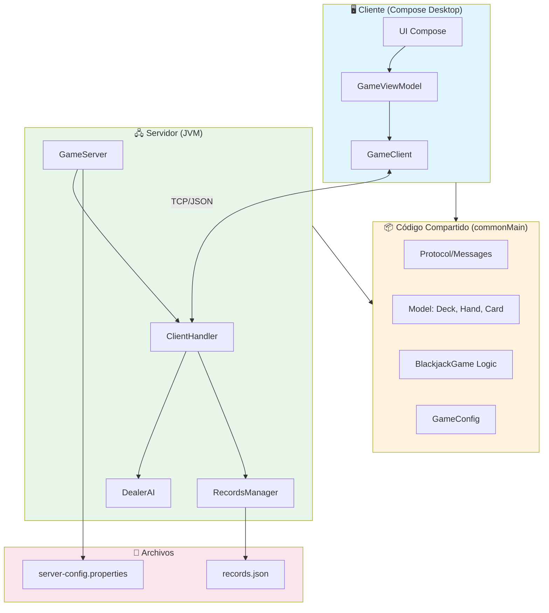
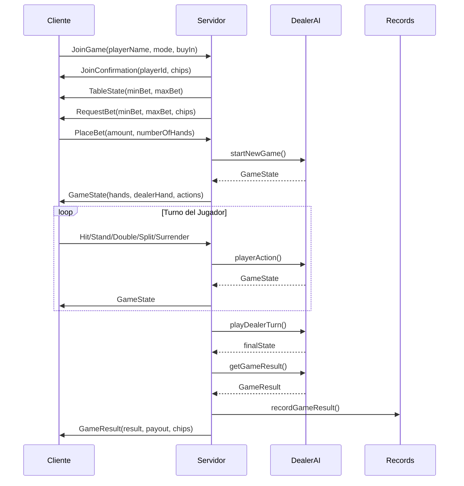

# 🎰 Blackjack Multijugador

Proyecto de Blackjack desarrollado en Kotlin Multiplatform con Compose Desktop.

## 📋 Características

- ✅ **Modo PVE**: Juega contra el dealer (IA)
- ✅ **Modo PVP**: Compite contra otros jugadores
- ✅ **Múltiples manos**: Juega hasta 3 manos simultáneamente
- ✅ **Comunicación en red**: Cliente-servidor con sockets TCP
- ✅ **Sistema de records**: Guarda estadísticas de jugadores en JSON
- ✅ **Historial de manos**: Últimas 10 manos jugadas con detalles
- ✅ **Configuración desde archivos**: `server-config.properties`
- ✅ **Interfaz gráfica**: UI completa con Compose Desktop
- ✅ **Manejo de errores**: Desconexiones, timeouts, validación de datos
- ✅ **Arquitectura limpia**: KMP con código compartido (commonMain)

## 🏗️ Diagrama de Arquitectura



## 📊 Diagrama de Secuencia: Flujo de Juego



## 🗂️ Estructura del Proyecto

```
Blackjack/
├── composeApp/              # Cliente Desktop
│   ├── src/
│   │   ├── commonMain/      # Código compartido
│   │   │   ├── protocol/    # Mensajes y protocolos
│   │   │   ├── model/       # Deck, Hand
│   │   │   ├── game/        # Lógica de Blackjack
│   │   │   └── config/      # Configuración
│   │   └── jvmMain/         # Cliente específico
│   │       ├── network/     # GameClient (sockets)
│   │       ├── viewmodel/   # Estado del juego
│   │       └── ui/          # Pantallas Compose
│
└── server/                  # Servidor JVM
    └── src/main/
        ├── kotlin/
        │   ├── GameServer.kt       # Servidor principal
        │   ├── ClientHandler.kt    # Manejo de clientes
        │   ├── DealerAI.kt         # IA del dealer
        │   └── RecordsManager.kt   # Gestión de records
        └── resources/
            └── server-config.properties
```

## 🚀 Cómo Ejecutar

### **1. Iniciar el Servidor**

Desde la raíz del proyecto:

```bash
./gradlew :server:run
```

El servidor se iniciará en el puerto **9999** (configurable en `server-config.properties`).

Salida esperada:
```
============================================================
🎰 SERVIDOR DE BLACKJACK INICIADO
============================================================
📡 Puerto: 9999
🎮 Esperando conexiones de clientes...
🛑 Presiona Ctrl+C para detener el servidor
============================================================
```

### **2. Iniciar el Cliente**

Desde otra terminal:

```bash
./gradlew :composeApp:run
```

Se abrirá la ventana del cliente. Introduce:
- **Host**: `localhost` (o IP del servidor)
- **Puerto**: `9999`
- Haz clic en **Conectar**

### **3. Jugar**

1. Introduce tu nombre de jugador
2. Selecciona modo **PVE** (vs Dealer)
3. Haz clic en **Jugar**
4. Usa los botones:
   - **🎴 PEDIR**: Solicitar una carta
   - **✋ PLANTARSE**: Finalizar tu turno
5. El dealer jugará automáticamente después de que te plantes

## 🎮 Flujo de Juego (Estilo Casino Real)

A diferencia de otros juegos de Blackjack que tratan cada mano como una "partida separada", este proyecto implementa un **flujo continuo de casino** donde:

1. **Te sientas en la mesa** una vez
2. **Juegas todas las manos que quieras** sin interrupciones
3. **Decides cuándo levantarte** de la mesa

### Flujo Visual

```
┌─────────────────────────────────────────────────────────────┐
│                    MESA DE BLACKJACK                        │
├─────────────────────────────────────────────────────────────┤
│                                                             │
│  ┌─────────────────────────────────────────────────────┐   │
│  │              ZONA DEL DEALER                         │   │
│  │                  🃏 🃏                                │   │
│  └─────────────────────────────────────────────────────┘   │
│                                                             │
│              ← ← ← FLUJO CONTINUO → → →                    │
│                                                             │
│   ╔═══════════╗    ╔═══════════╗    ╔═══════════╗         │
│   ║  APOSTAR  ║ ══▶║   JUGAR   ║ ══▶║ RESULTADO ║ ═══╗    │
│   ╚═══════════╝    ╚═══════════╝    ╚═══════════╝    ║    │
│         ▲                                             ║    │
│         ║                                             ║    │
│         ╚══════════════════════════════════════════════╝    │
│                                                             │
│  ┌─────────────────────────────────────────────────────┐   │
│  │              ZONA DEL JUGADOR                        │   │
│  │              💰 Fichas: 1000                         │   │
│  │                  🃏 🃏                                │   │
│  └─────────────────────────────────────────────────────┘   │
│                                                             │
└─────────────────────────────────────────────────────────────┘
```

### Fases de la Mesa

| Fase | Descripción | Acciones Disponibles |
|------|-------------|----------------------|
| **BETTING** | Esperando tu apuesta | Elegir cantidad, elegir manos, REPARTIR |
| **PLAYING** | Tu turno de jugar | PEDIR, PLANTARSE, DOBLAR, DIVIDIR, RENDIRSE |
| **DEALER** | El dealer juega | (Automático) |
| **RESULT** | Resultado de la mano | REPETIR APUESTA, CAMBIAR APUESTA, ABANDONAR |

### Sistema de Fichas

```
Fichas Iniciales: 1000
Apuesta Mínima:   10
Apuesta Máxima:   500

Pagos:
  • Victoria normal:  1:1 (apuestas 50 → ganas 50)
  • Blackjack:        3:2 (apuestas 50 → ganas 75)
  • Empate (Push):    0   (recuperas tu apuesta)
  • Derrota:         -1:1 (pierdes tu apuesta)
  • Rendición:       -0.5 (pierdes mitad de apuesta)
```

### Repetir Última Apuesta

Después de cada mano, puedes:
- **🔄 REPETIR**: Usa la misma apuesta de la mano anterior
- **💰 CAMBIAR**: Vuelve a elegir una nueva cantidad

Esto permite un flujo rápido sin tener que configurar la apuesta cada vez.

## 🃏 Reglas del Blackjack

### Objetivo
Llegar a 21 o lo más cerca posible **sin pasarte**.

### Valores de las Cartas

| Carta | Valor |
|-------|-------|
| 2-10 | Su valor nominal |
| J, Q, K | 10 |
| As | 1 u 11 (se ajusta automáticamente) |

### Reglas del Dealer
- Debe **pedir** si tiene 16 o menos
- Debe **plantarse** si tiene 17 o más
- No puede doblar, dividir ni rendirse

### Blackjack Natural
As + carta de valor 10 con solo 2 cartas = **Blackjack** (paga 3:2)

## 📖 Manual de Usuario

### Inicio Rápido

1. **Inicia el servidor**: `./gradlew :server:run`
2. **Inicia el cliente**: `./gradlew :composeApp:run`
3. **Conecta**: Introduce host (`localhost`) y puerto (`9999`)
4. **Elige modo**: PVE (contra dealer) o PVP (multijugador)
5. **Apuesta**: Selecciona cantidad y número de manos
6. **¡Juega!**

### Acciones Disponibles

| Acción | Botón | Descripción |
|--------|-------|-------------|
| **Pedir** | 🎴 PEDIR | Solicita una carta adicional |
| **Plantarse** | ✋ PLANTARSE | Finaliza tu turno |
| **Doblar** | 💰 DOBLAR | Dobla la apuesta y recibe solo 1 carta |
| **Dividir** | ✂️ DIVIDIR | Divide una pareja en dos manos |
| **Rendirse** | 🏳️ RENDIRSE | Abandona y recupera 50% de la apuesta |

### Jugar Múltiples Manos

1. En la pantalla de apuestas, selecciona **1, 2 o 3 manos**
2. Cada mano tiene su propia apuesta (apuesta × número de manos)
3. Juega cada mano por turnos
4. El dealer juega contra todas tus manos al final

### Pantallas del Cliente

| Pantalla | Función |
|----------|---------|
| **Menú Principal** | PVE, PVP, Records, Configuración, Salir |
| **Conexión** | Introducir host y puerto del servidor |
| **Apuestas** | Seleccionar apuesta y número de manos |
| **Juego** | Mesa de Blackjack con controles |
| **Resultado** | Victoria/Derrota con estadísticas |
| **Records** | Top 10 jugadores con estadísticas |
| **Historial** | Últimas 10 manos jugadas |
| **Configuración** | Número de mazos (1, 2, 4) |

### Iconos de la Interfaz

- 🏆 Ver records del servidor
- 📜 Ver historial de manos
- ❌ Desconectar/Salir
- ⚠️ Indicador de riesgo de pasarse

## 📊 Sistema de Records e Historial

### Records (records.json)
Los records se guardan automáticamente y incluyen:
- Nombre del jugador
- Victorias / Derrotas / Empates
- Número de Blackjacks naturales
- Porcentaje de victorias
- Fichas máximas alcanzadas
- Mejor racha de victorias
- Ganancia/pérdida total

### Historial de Manos
Cada sesión guarda las últimas 10 manos con:
- Cartas del jugador y dealer
- Puntuaciones finales
- Resultado (Victoria/Derrota/Empate/Blackjack/Rendición)
- Apuesta y pago
- Hora de la mano

Accede al historial con el botón 📜 durante el juego.

## ⚙️ Configuración del Servidor

Edita `server/src/main/resources/server-config.properties`:

```properties
# Puerto del servidor
server.port=9999

# Máximo de jugadores por mesa (PVP)
server.maxPlayersPerTable=4

# Habilitar modos
server.pveEnabled=true
server.pvpEnabled=true

# Timeout de conexión en segundos
server.connectionTimeout=60

# Archivo de records
server.recordsFile=records.json
```

## 🛠️ Tecnologías Utilizadas

- **Kotlin Multiplatform (KMP)**: Compartir código entre cliente y servidor
- **Compose Desktop**: Interfaz gráfica moderna
- **kotlinx.coroutines**: Concurrencia y manejo asíncrono
- **kotlinx.serialization**: Serialización JSON de mensajes
- **Java Sockets**: Comunicación TCP cliente-servidor

## 🧪 Testing

Para probar múltiples clientes simultáneamente:

```bash
# Terminal 1: Servidor
./gradlew :server:run

# Terminal 2: Cliente 1
./gradlew :composeApp:run

# Terminal 3: Cliente 2
./gradlew :composeApp:run
```

## 📝 Protocolo de Comunicación

### Mensajes Cliente → Servidor

| Mensaje | Descripción | Parámetros |
|---------|-------------|------------|
| `JoinGame` | Unirse al juego | playerName, gameMode, buyIn |
| `PlaceBet` | Realizar apuesta | amount, numberOfHands |
| `RequestCard` | Pedir carta (Hit) | - |
| `Stand` | Plantarse | - |
| `Double` | Doblar apuesta | - |
| `Split` | Dividir pareja | - |
| `Surrender` | Rendirse | - |
| `NewGame` | Nueva partida | - |
| `RequestRecords` | Solicitar records | - |
| `RequestHistory` | Solicitar historial | - |
| `SelectHand` | Seleccionar mano activa | handIndex |
| `Ping` | Mantener conexión | - |

### Mensajes Servidor → Cliente

| Mensaje | Descripción |
|---------|-------------|
| `JoinConfirmation` | Confirmación de unión con playerId y fichas |
| `TableState` | Estado de la mesa (jugadores, límites) |
| `RequestBet` | Solicitud de apuesta con límites |
| `GameState` | Estado actual del juego (manos, acciones) |
| `GameResult` | Resultado final (victoria, pago, fichas) |
| `RecordsList` | Lista de mejores jugadores |
| `HandHistoryList` | Historial de manos jugadas |
| `Error` | Mensaje de error |
| `Pong` | Respuesta a Ping |

Todos los mensajes son JSON serializados con kotlinx.serialization.

## 📦 Estructura de Datos

### Card (Carta)
```kotlin
data class Card(
    val rank: Rank,  // A, 2-10, J, Q, K
    val suit: Suit,  // ♥, ♦, ♣, ♠
    val hidden: Boolean = false
)
```

### GameState (Estado del Juego)
```kotlin
data class GameState(
    val playerHand: List<Card>,
    val dealerHand: List<Card>,
    val playerScore: Int,
    val dealerScore: Int,
    val gameState: GamePhase,
    val canRequestCard: Boolean,
    val canStand: Boolean
)
```

## 🐛 Solución de Problemas

### El cliente no se conecta
- Verifica que el servidor esté ejecutándose
- Comprueba que el puerto no esté bloqueado por firewall
- Asegúrate de usar `localhost` si es en la misma máquina

### Error "Address already in use"
- Hay otro proceso usando el puerto 9999
- Cambia el puerto en `server-config.properties`
- O mata el proceso: `lsof -ti:9999 | xargs kill`

### El juego se congela
- Verifica los logs en la terminal del servidor
- El cliente se desconectará automáticamente tras 60s de inactividad

## 👥 Créditos

Proyecto desarrollado como parte del curso de DAM (Desarrollo de Aplicaciones Multiplataforma).

## 📄 Licencia

Proyecto educativo - Uso libre para aprendizaje.
